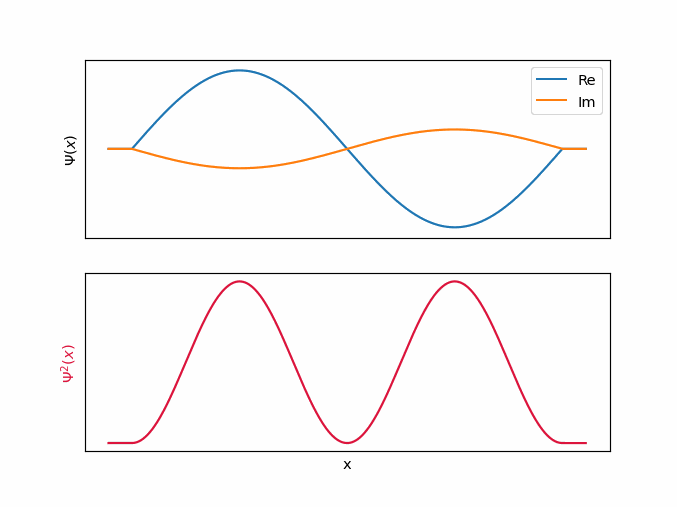
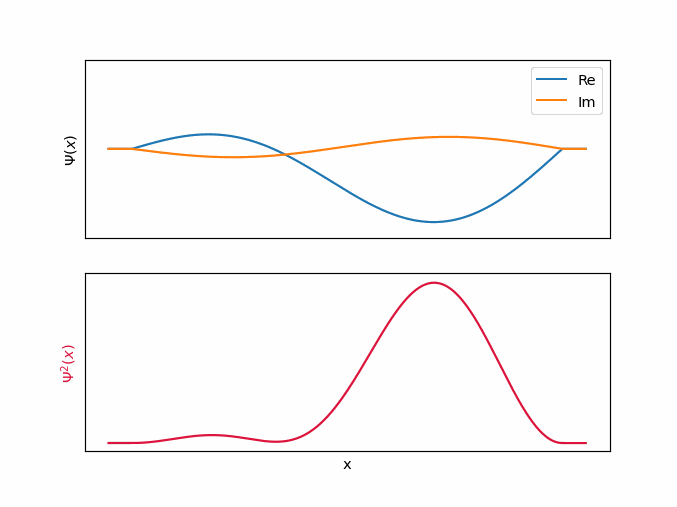
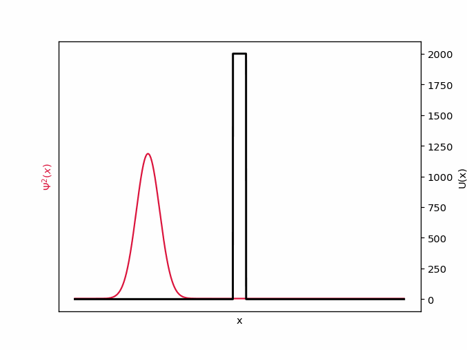
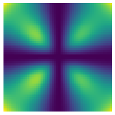

# Numeryczne rozwiązywanie równania Schrödingera
Krzysztof Nowak
24.05.2021r

## Wstęp

Chyba każdy, kto choć trochę interesuje się fizyką słyszał o pewnym jednocześnie żywym i martwym kocie; lub o elektronach, których pozycja i pęd pozostają nieokreślone. Nic w tym dziwnego, zagadki mechaniki kwantowej inspirują wyobraźnie i zaprzątją umysły. Zawsze jednak byłem zawiedziony faktem, że opis mikroświata ukryty jest za nieprzystępnymi symbolami matematycznymi, a zwykłemu uczniowi pozostają jednie jakościowe charakteryzacje obserwowanych zjawisk. Postanowiłem to zmienić i w sposób dosyć nieudolny, bo z pomocą komputera, a nie ścisłego formalizmu matematycznego, "pobawić się" elektronem w mikroskali.

## Równanie Schrödingera
$$i\hbar \cfrac{\partial\psi}{\partial t} 
= \left[-\cfrac{\hbar^2}{2m}\cfrac{\partial^2}{\partial x^2} + V(x,t)\right] \psi$$

Równanie Schrödingera jest podstawowym elementem mechaniki kwantowej. Opisuje funkcję falową oraz jej zmiany w czasie. Czym jest funkcja falowa $\psi(x,t)$? Nie da się jej zinterpretować wprost, jednak zawieraja wszystkie informacje o położeniu i pędzie analizowanej cząstki, które możemy wyłuskać przy użyciu odpowiednich operacji. Na przykład $|\psi(x,t)|^2$ (kwadrat modułu w sensie liczb zespolonych) opisuje gęstość prawdopodobieństwa, czyli szanse, że cząstka znajduje się w danej objętości przestrzeni. 
Drugim bardzo istotnym elementem jest funkcja $V(x,t)$ opisująca zadany potencjał, w którym porusza się cząsteczka. Potencjał najczęściej jest wynikiem oddziaływania elektrycznego (jak np. elektron w atomie wodoru), jednak może być zadany dowolną inną funkcją. Możemy dostrzec również symbole pochodnych cząstkowych $\cfrac{\partial\psi}{\partial t}$, $\cfrac{\partial^2}{\partial x^2}$ wskazujących, że mamy do czynienia z równaniem różniczkowym. Pozostałe symbole to stałe: $\hbar$ — zredukowana stała Plancka, oznacza kwant momentu pędu; $m$ — masa cząstki oraz $i$ — jednostka urojona, w sensie liczb zespolonych.

## Jak to rozwiązać?
Najprostsze do rozwiązania są problemy stacjonarne (na przykład [studnia potencjału](#studnia_potencjału)), to znaczy takie, w których moduł $\psi$ nie zmienia się z upływem czasu, a funkcja drga niczym fala stojąca na sznurku. Wtedy równanie przyjmuje taką postać[^quantum_mechanics_35]:
$$ E \psi = \left[-\cfrac{\hbar^2}{2m}\cfrac{\partial^2}{\partial x^2} + V(x)\right] \psi$$
[^quantum_mechanics_35]: Quantum Mechanics, B.H. Bransden & C.J. Joachain, Rozdział 3.5

Równanie wygląda troszeczkę przyjmniej, jednak wciąż nie wiadomo, co można z nim zrobić. Z odsieczą przyjdzie nam kilka matematycznych sztuczek. Wyobraźmy sobie, że $\psi(t)$ jest wektorem o nieskończonej liczbie wymiarów (ściślej mówiąc, jest w przestrzeni Hilberta), a każdy wymiar wektora opisuje jeden punkt w przestrzeni funkcji. Rysunek poniżej jest bardzo poglądowy, gdzyż pomija fakt, że $\psi$ przyjmuje wartości zespolone, a wektor ma continuum wymiarów. 

Taka wektorowa interpretacja pozwoli nam na stosowanie metod algebry liniowej. Niestety komputery krzemowe nie pojmują nieskończoności, dlatego zamiast martwić się continuum wymiarowym wektorem, wygodnie podzielimy przestrzeń na $n=1000$ odcinków.  

Jeżeli uznamy $\psi$ za skończony wektor to jak możemy rozumieć pochodną $\frac{\partial^2}{\partial x^2}$? Rozważmy jeden punkt w przestrzeni. Obserwując różnice między punktami z jego otoczenia, możemy wyliczyć przybliżenie pochodnej w tym miejscu, dokładniej, korzystając z szeregu Taylora, otrzymujemy następującą postać aproksymacji:
$$\frac{\partial^2\psi}{\partial x^2}(x) \approx \frac{\psi(x+\Delta x) -2\psi(x) + \psi(x-\Delta x) }{(\Delta x)^2}$$,gdzie $\Delta x = \cfrac{x_n - x_1}{n}$ to długość jednego odcinka symulacji.
Okazuje się, że mamy do czynienia z przekształceniem liniowym, dlatego po uwzględnieniu warunków brzegowych możemy wpisać współczynniki w odpowiednie miejsca trójprzekątniowej macierzy przekształcenia liniowego:
$$\frac{\partial^2}{\partial x^2} = \cfrac{1}{(\Delta x)^2}\begin{pmatrix}
2 & -5 & 4 & -1 & 0 & 0 & \dots & 0\\
1 & -2 & 1 & 0 & 0 & 0 & \dots & 0\\
0 & 1 & -2 & 1 & 0 & 0 & \dots & 0\\
0 & 0 & 1 & -2 & 1 & 0 & \dots & 0\\
0 & 0 & 0 & 1 & -2 & 1 & \dots & 0\\
\vdots
\end{pmatrix}_{n\times n}$$
Wtedy całe wyrażenie $\left[-\cfrac{\hbar^2}{2m}\cfrac{\partial^2}{\partial x^2} + V(x)\right]$, które będziemy oznaczać $\hat{H}$, staje się macierzą przekształcenia liniowego. 

Podsumowując, chcemy rozwiązać równanie $E \psi = H \psi$, gdzie $\bar{H}$ to macierz, E skalar, a $\psi$ wektor. Czy to czegoś nie przypomina? Ależ oczywiście, jest to problem znajdowania wektorów i wartości własnych macierzy. Na szczęście wyznaczanie wartości własnych jest całkiem popularnym problem, także nie musimy się nim martwić i możemy skorzystać z gotowych rozwiązań[^arpack]. Sprowadziliśmy problem do zagadnienia już rozwiązanego, a czy nie o to w życiu chodzi? 

[^arpack]: https://www.caam.rice.edu/software/ARPACK/UG/node45.html

## Studnia potencjału
Studnia potencjału to układ, w którym cząsteczka znajduje się w lokalnym minimum potencjału, otoczonym barierą nieskończonego potencjału. Elektron jest spułapkowany "na dnie studni" — jego energia kinetyczna jest niewystarczajacą do przekroczenia bariery. Okazuje się, że elektron umieszczony w takim układzie nie może mieć dowolnych prędkości i energii, tak jak miałoby to miejsce w przypadku klasycznej mechaniki. Może przyjmować jedynie ściśle określone wartości. Poniżej przedstawione jest wyliczenie pierwszych 5 modów oscylacji i ich energii. 

## Upływ czasu
A co gdybyśmy chcieli zobaczyć nasz elektron w ruchu? Możemy skorzystać z metody Cranka-Nicolson[^phys_utah]. Symulację zaczynamy znając pewną początkową wartość funkcji $\psi(t=0)$ i stały operator $\hat{H}$. Rozwiązując metodami algebry liniowej poniższe równanie, otrzymujemy stan układu po upływie pewnego małego czasu $\Delta t$. 
$$\left(1-\frac{\hat{H} \Delta t}{2i\hbar}\right)\psi(t+\Delta t) = \left(1+\frac{\hat{H} \Delta t}{2i\hbar}\right)\psi(t)$$
Krok ten możemy powtarzać dowolną liczbę razy, wyliczając stany układu w momentach: $0, \Delta t, 2\Delta t, 3\Delta t \dots$ Następnie serię pojedynczych stanów możemy złożyć w płynną animację.
[^phys_utah]: http://www.physics.utah.edu/~detar/phycs6730/handouts/crank_nicholson/crank_nicholson/

## Wolna cząsteczka i zasada nieoznaczoności
Rozważmy elektron poruszający się z pewną prędkością w prawo, bez oddziaływań zewnętrznych. Zadamy go następującym pakietem:
$$\psi(x, t=0) = e^{-\dfrac{1}{2}\left(\dfrac{x-x_0}{\sigma_x}\right)^2}e^{-ikx},$$ gdzie $x_0$ to położenie początkowe, $k$ liczba falowa, $\sigma_x$ niepewność położenia początkowego. W jednym przypadku weźmy $\sigma_x = 0.1$,

a w drugim $\sigma_x = 0.2$.

W obu przypadkach wraz z upływem czasu niepewność położenia wzrasta. Jest to spowodowane tym, że zgodnie z zasadą nieoznaczoności pęd (więc również prędkość) nie może być dokładnie znana.
$$ \sigma_p \geq \cfrac{\hbar}{2\sigma_x} $$
Im dokładniej znamy położenie $\sigma_x$ tym większą niepewność $\sigma_p$. Co za tym idzie wierzchołek na górnym wykresie ulega znacznie szybszemu spłaszczeniu, bo zawiera dokładniejszą informację o pozycji. Pod koniec symulacji oba wykresy niemalże zrównuje się, ponieważ zawierały taką samą, maksymalną ilość informacji. Warto podkreślić, że takie zachowanie nie jest spowodowane jakąkolwiek niedoskonałością fizycznych pomiarów, bądź symulacji, lecz jest elementem działania wszechświata, który został zakodowany w równaniu Schrödingera.

## Studnia potencjału zależna od czasu
Możemy również zasymulować zachowanie w czasie wspomnianej wcześniej [studni potencjału](#studnia-potencjału). Jako stan początkowy przyjmiemy wcześniej wyliczony stan o $n=2$. $\psi(t=0) =\psi_{n=2}$. 

Zauważmy, że funkcja rzeczywiście oscyluje, jednocześnie zachowując stały rozkład prawdopodobieństwa, dlatego jest prawidłowym rozwiązaniem stacjonarnym.

## Superpozycja
Funkcja falowa może być kombinacją liniową rozwiązań stacjonarnych. Za stan początkowy przyjmijmy $\psi(t=0) = \cfrac{1}{\sqrt{2}}\left(\psi_{n=1} + \psi_{n=2}\right)$. Czynnik $\cfrac{1}{\sqrt{2}}$ ma na celu znormalizowanie funkcji, pominięcie tego kroku skutkowałoby pradopodobieństwami dodającymi się do liczby większej niż 1. 

Okazuje się, że rozkład prawdopodobieństwa przestał być stacjonarny. Prawdopodobieństwo znalezienia cząstki, w danym miejscu przestrzeni okazuje się być zależne od czasu. Co ciekawe, w momencie dokonania obserwacji cząsteczki, funkcja falowa skolapsuje się do jednego ze stanów stacjonarnych, z których się składa.

## Zjawisko tunelowe

Rozważmy elektron poruszający się z prędkością $v=60$. Jego energia wynosi wtedy $E=\cfrac{mv^2}{2} = 1800$. Ustalmy barierę potencjału o wartości $V=2000$. Jak zachowa się elektron? Według fizyki klasycznej, nie posiada on dostatecznej energi kinetycznej, aby wejść w strefę wzbronioną i przedostać się na drugą stronę, więc odbija się od niej. Sprawa wygląda inaczej w świetle mechaniki kwantowej. Część fali rzeczywiście ulegnie odbiciu, jednak reszta przedostanie się na drugą stronę. Nazywane jest to zjawiskiem tunelowym.

Po przejściu przez barierę, funkcja składa się z dwóch rozłącznych rozkładów normalnych. Jeden znajduje się z lewej strony bariery, drugi z prawej. Jak możemy to interpretować? Elektrony przebijają się na drugą stronę bariery, ale czynią to z pewnym prawdopodobieństwem, równym całce pod prawym rozkładem. Dla konkretnego, fizycznego elektronu, nie mamy możliwości stwierdzenia po której stronie bariery się znajduje, dopóki nie dokonamy obserwacji.

Prawdopodobieństwo przekroczenia bariery zależy od jej szerokości oraz niedoboru enrgi cząsteczki. Jeżeli przyjrzymy się wolniejszemu elektronowi o $v=50$, czyli $E=1250$, okaże się, że nie przebija się on tak ochoczo jak jego poprzednik, ponieważ posiada ponad 3 razy większy niedobór energi.

## Orbitale wodoru
Nic nie stoi na przeszkodzie, aby powyższe metody rozszerzyć na wyższą liczbę wymiarów. Możemy rozważyć atom wodoru zadając potencjał pochodzący od jego jądra
$$V(x,y,z) = \cfrac{-1}{4\pi \sqrt{x^2+y^2+z^2}}.$$

Przedstawione zostały wykresy $|\psi|^2$ w przecięciu płaszczyzną XY, gdzie kolory jasne oznaczają wysokie gęstości prawdopodobieństwa, a ciemnie  — bliskie zeru. Z odrobiną wyobraźni możemy dostrzec w nich dobrze znane kształty orbitali wodoru.

| n | s | p  | d |
---|--- | --- | ---
|1|| - | - |
|2|||-|
|3| ? |  |  |

Niestety orbitalu 3s i wyższych nie udało się wyliczyć.

## Kody
Kod źródłowy do wykonania obliczeń jest dostępny na [GitHubie](https://github.com/krzysztof9nowak/quantum_tricks).

## Bibliografia 
Quantum Mechanics, B.H. Bransden & C.J. Joachain

Algebraiczne metody rozwiązywania równania Schrodingera, W. Salejda, M.H. Tyc, M. Just 

https://dantoudai.wordpress.com/2020/06/07/schrodingers-python-2/

https://jakevdp.github.io/blog/2012/09/05/quantum-python/