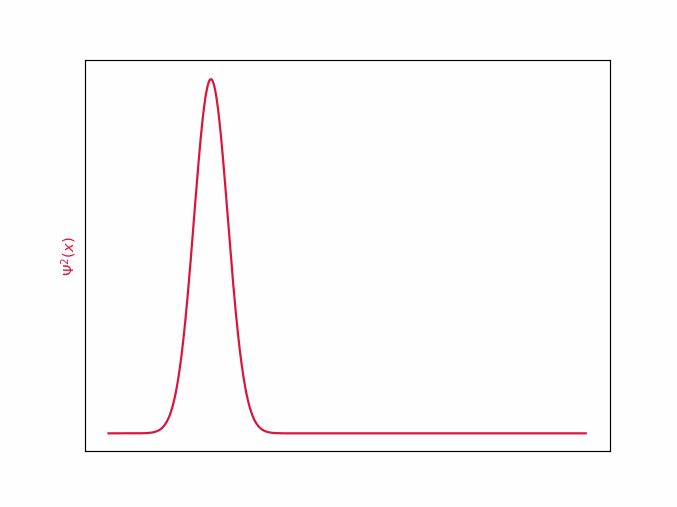

# Zabawa z fal(k)ami, czyli numeryczne rozwiązywanie równania Shrodingera

## Wstęp
Chyba każdy, kto choć trochę interesuje się fizyką słyszał o pewnym żywo-martwym kocie i o uwięzionych elektronach, które są, lecz nie wiadomo gdzie. Nic w tym dziwnego, cuda mechaniki kwantowej zaprzątają nasze umysły. Zawsze jednak mierził mnie fakt, że opis mikroświata ukryty jest za trudnymi konceptami matematycznymi, a zwykłemu człowiekowi pozostają jednie jakościowe charakteryzacje . Postanowiłem to zmienić, i w sposób dosyć nieudolny, z pomocą komputera, a nie formalizmu matematycznego "pobawić się" elektronami.

## Równanie Shrödingera
$$i\hbar \cfrac{\partial\psi}{\partial t} 
= \left[-\cfrac{\hbar^2}{2m}\cfrac{\partial^2}{\partial x^2} + V(x,t)\right] \psi$$

Równanie Shrödingera jest podstawowym elementem mechaniki kwantowej. Opisuje funkcję falową oraz jej zmiany w czasie. Czym jest funkcja falowa $\psi$? Nie da się jej zinterpretować wprost, jednak zawiera wszystkie informacje o położeniu i pędzie analizowanej cząstki, które możemy wyłuskać przy użyciu odpowiednich operacji. Kwadrat modułu (w sensie liczb zespolonych) funkcji $|\psi|^2$ opisuje gęstość prawdopodobieństwa, czyli szanse, że cząstka znajduje się w tej okolicy. 

$\psi(x, t)$ zależy od położenia w przestrzeni i czasu, przyjmuje natomiast wartości zespolone. 

## Jak to rozwiązać?
Najprostsze do rozwiązania są problemy stacjonarne, to znaczy takie, w których moduł funkcji nie zmienia się z upływem czasu, a funkcja drga niczym fala stojąca na sznurku. Wtedy równanie przyjmuje taką postać:
$$ E \psi = \left[-\cfrac{\hbar^2}{2m}\cfrac{\partial^2}{\partial x^2} + V(x)\right] \psi$$
[wyprowadzenie](https://tutaj_wyprowadzenie_dodaj.com)

Równanie wygląda troszeczkę przyjmniej, jednak wciąż niezbyt wiadomo co można z nim zrobić. Z odsieczą przyjdzie nam kilka matematycznych konceptów. Okazuje się, że $\psi$ można utożsamiać z wektorem o nieskończonej liczbie wymiarów (ściślej mówiąc z wektorem z przestrzeni Hilberta). Jeżeli $\psi$ jest wektorem to czym jest $\left[-\cfrac{\hbar^2}{2m}\cfrac{\partial^2}{\partial x^2} + V(x)\right]$? Otóż jest to macierz kwadratowa, 

Jak możemy policzyć pochodną dla dyskretnej funkcji? Możemy użyc pierwszych wyrazów szeregu Talora, lecz na odwrót niż zwykle. Przybliżenia pierwszego stopnia drugiej pochodnej wyglądają następujaco:

$$\frac{\partial^2\psi}{\partial x^2}(x) \approx \frac{\psi(x+\Delta x) -2\psi(x) + \psi(x-\Delta x) }{(\Delta x)^2}$$

$$\frac{\partial^2}{\partial x^2} = \begin{pmatrix}
2 & -5 & 4 & -1 & 0 & 0 & \dots & 0\\
0 & 1 & -2 & 1 & 0 & 0 & \dots & 0\\
0 & 0 & 1 & -2 & 1 & 0 & \dots & 0\\
0 & 0 & 0 & 1 & -2 & 1 & \dots & 0\\
\vdots
\end{pmatrix}_{N\times N}$$

Taka macierz nazywana jest Hamiltonianem (operatorem Hamiltona) i jest oznaczna H. Tralala liczy energie falki.

Niestety komputer krzemowe nie radzą sobie najlepiej z nieskończonościami, dlatego będziemy musieli zadowolić się aproksymacją przez wektor o $n=1000$ wymiarach. 

Podsumowując, chcemy rozwiązać równanie $E \psi = H \psi$, gdzie $H$ to macierz, E skalar, a $\psi$ wektor. Czy to czegoś nie przypomina? Ależ oczywiście, jest to problem znajdowania wektorów i wartości własnych macierzy, który można spotkać na wykładzie z algebry liniowej. Szczerze mówiąc, byłem ogromnie uradowany, że tak pozornie nudny koncept, który niedawno poznałem, okaże się użyteczny w takim miejscu. 

Na szczęście wyznaczanie wartości własnych jest całkiem popularnym problem, także nie musimy się nim martwić. Sprowadziliśmy problem do zagadnienia już rozwiązanego, a czyż nie o to w życiu chodzi?

## Studnia potencjału
Najprostszy problem fizyki kwantowej, który można stosunkowo łatwo rozwiązać, nawet metodami analitycznymi to elektron umieszczony w tak zwanej studni potencjału. Studnia potencjału to potencjał, taki, że na pewnym przedziale przyłożony potencjał zewnętrzny jest równy zeru, poza nim natomiast wynosi on nieskończoność. Elektron jest spułapkowany "na dnie studni", gdyż jego energia kinetyczna i potencjalnie jest niewystarczajacą do przekroczenia nieskończenie wysokiej bariery. Poza teoretycznym rozważaniem, takiem układem mogą być dwie płyty oddalone o (naście wstaw tutaj jakąś liczbę nm).

$$ \hbar = e = m = 1$$

## Uplyw czasu
A co gdybyśmy chcieli zobaczyć nasz elektron w ruchu?

## Wolna cząsteczka

## Atom wodoru w 3D

## Ewolucja w czasie
## Eigenstany
- Rozkład na stany
- eigenvalues to Energie

## Kody
Kod źródłowy do wykonania obliczeń jest dostępny na [moim GitHubie](https://github.com/krzysztof9nowak/quantum_tricks).

## Bibliografia
Włodzimierz Salejda 

https://www.caam.rice.edu/software/ARPACK/UG/node45.html

https://dantoudai.wordpress.com/2020/06/07/schrodingers-python-2/

Quatnum Mechanics, B.H. Bransden & C.J. Joachain

http://www.physics.utah.edu/~detar/phycs6730/handouts/crank_nicholson/crank_nicholson/

https://jakevdp.github.io/blog/2012/09/05/quantum-python/