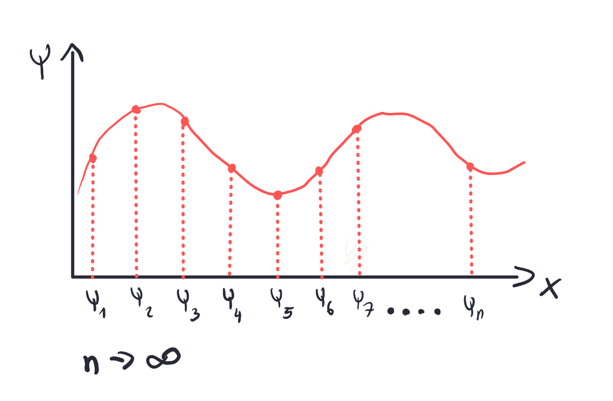
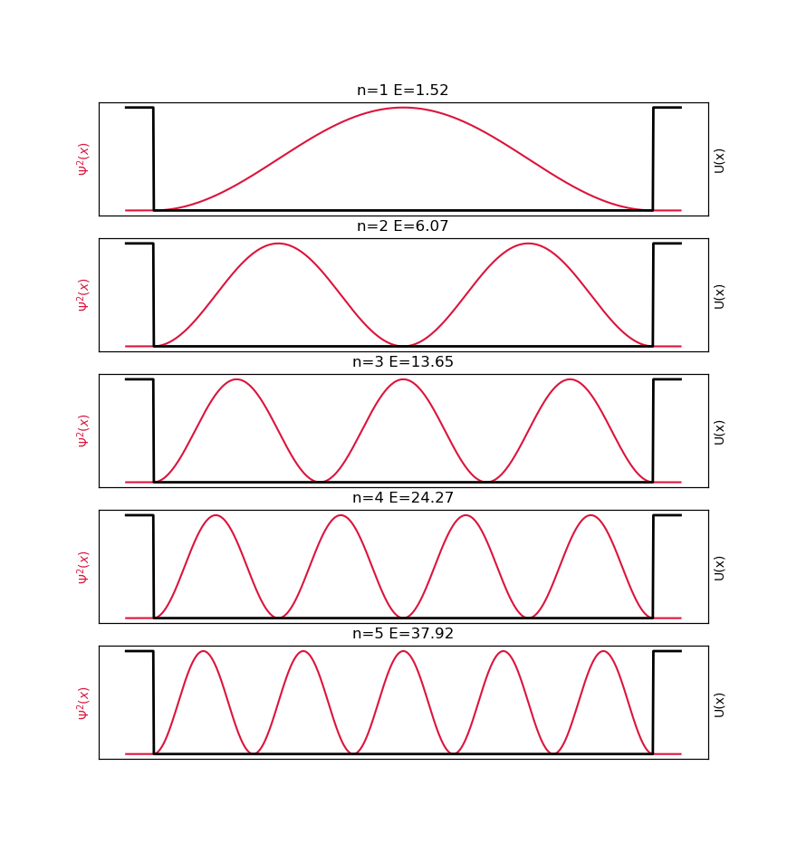
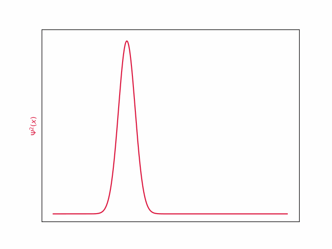
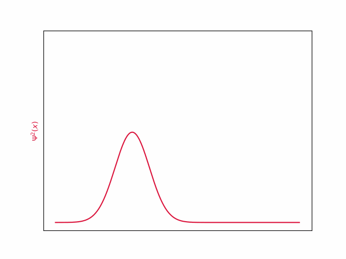
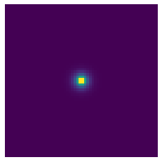
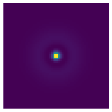
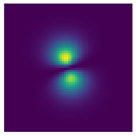
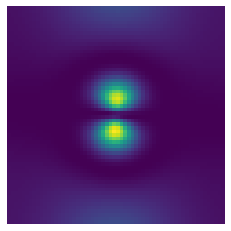

# Numeryczne rozwiązywanie równania Shrödingera
Krzysztof Nowak
24.05.2021r

## Wstęp

Chyba każdy, kto choć trochę interesuje się fizyką słyszał o pewnym żywo-martwym kocie i o uwięzionych elektronach, które są, lecz nie wiadomo gdzie. Nic w tym dziwnego, cuda mechaniki kwantowej bardzo łatwo porywają wyobraźnie. Zawsze jednak mierził mnie fakt, że opis mikroświata ukryty jest za nieprzystępnymi symbolami matematycznymi, a zwykłemu człowiekowi pozostają jednie jakościowe charakteryzacje zjawisk. Postanowiłem to zmienić, i w sposób dosyć nieudolny, bo z pomocą komputera, a nie ścisłego formalizmu matematycznego, "pobawić się" elektronem.

## Równanie Shrödingera
$$i\hbar \cfrac{\partial\psi}{\partial t} 
= \left[-\cfrac{\hbar^2}{2m}\cfrac{\partial^2}{\partial x^2} + V(x,t)\right] \psi$$

Równanie Shrödingera jest podstawowym elementem mechaniki kwantowej. Opisuje funkcję falową oraz jej zmiany w czasie. Czym jest funkcja falowa $\psi(x,t)$? Nie da się jej zinterpretować wprost, jednak jej zespolone wartości zawierają wszystkie informacje o położeniu i pędzie analizowanej cząstki, które możemy wyłuskać przy użyciu odpowiednich operacji. Na przykład $|\psi(x,t)|^2$ (kwadrat modułu w sensie liczb zespolonych) opisuje gęstość prawdopodobieństwa, czyli szanse, że cząstka znajduje się w danej objętości przestrzeni. Drugim bardzo istotnym elementem jest funkcja opisująca potencjał, w którym cząsteczka może się znaleźć. $V(x,t)$ opisuje jej energię potencjalną, w danym punkcie. Potencjał najczęściej jest wynikiem oddziaływania elektrycznego (jak w przypadku elektronu), jednak może być dowolnie zadany. 

Pozostałe literki? $\hbar$ to stała Plancka kreślona V(x,t) to potencjał, opisuję jaką energię potencjalną miałaby cząstka, gdyby znalazła się w tym punkcie i czasie. 

## Jak to rozwiązać?
Najprostsze do rozwiązania są problemy stacjonarne (na przykład [studnia potencjału](#studnia_potencjału)), to znaczy takie, w których moduł $\psi$ nie zmienia się z upływem czasu, a funkcja drga niczym fala stojąca na sznurku. Wtedy równanie przyjmuje taką postać[^quantum_mechanics_35]:
$$ E \psi = \left[-\cfrac{\hbar^2}{2m}\cfrac{\partial^2}{\partial x^2} + V(x)\right] \psi$$
[^quantum_mechanics_35]: rozdział 3.5, Quantum Mechanics, B.H. Bransden & C.J. Joachain

Równanie wygląda troszeczkę przyjmniej, jednak wciąż niezbyt wiadomo co można z nim zrobić. Z odsieczą przyjdzie nam kilka matematycznych sztuczek. Wyobraźmy sobie, że $\psi(t)$ jest wektorem o nieskończonej liczbie wymiarów (ściślej mówiąc, jest w przestrzeni Hilberta), a każdy wymiar wektora opisuje jeden punkt w przestrzeni funkcji. Rysunek poniżej jest jedynie poglądowy, gdzyż pomija fakt, że $\psi$ jest zespolone, a wektor ma continuum wymiarów. 

Taka wektorowa interpretacja pozwoli nam na stosowanie metod algebry liniowej. Niestety komputery krzemowe nie pojmują nieskończoności, dlatego zamiast martwić się continuum wymiarowym wektorem, wygodnie podzielimy przestrzeń na $n=1000$ odcinków.  

Chcielibyśmy myśleć o $\hat{H} = \left[-\cfrac{\hbar^2}{2m}\cfrac{\partial^2}{\partial x^2} + V(x)\right]$ jak o macierzy, która działa jako operator (zwany operatorem Hamiltona) na wektorze $\psi$. Problem jest jendak jak sprowadzić $\frac{\partial^2}{\partial x^2}$ do macierzy? Rozważmy jeden punkt w przestrzeni. Obserwując różnice Korzystając z szeregu Taylora, możemy wyliczyć następującą postać aproksymacji w punkcie x:

$$\frac{\partial^2\psi}{\partial x^2}(x) \approx \frac{\psi(x+\Delta x) -2\psi(x) + \psi(x-\Delta x) }{(\Delta x)^2}$$,gdzie $\Delta x = \cfrac{x_n - x_1}{n}$.

Zauważmy, że są to przekształcenia liniowe, dlatego możemy wpisać współczynniki w odpowiednie miejsca macierzy

$$\frac{\partial^2}{\partial x^2} = \cfrac{1}{(\Delta x)^2}\begin{pmatrix}
2 & -5 & 4 & -1 & 0 & 0 & \dots & 0\\
1 & -2 & 1 & 0 & 0 & 0 & \dots & 0\\
0 & 1 & -2 & 1 & 0 & 0 & \dots & 0\\
0 & 0 & 1 & -2 & 1 & 0 & \dots & 0\\
0 & 0 & 0 & 1 & -2 & 1 & \dots & 0\\
\vdots
\end{pmatrix}_{n\times n}$$

Taka macierz nazywana jest Hamiltonianem (operatorem Hamiltona) i jest oznaczna H. Tralala liczy energie falki.

Podsumowując, chcemy rozwiązać równanie $E \psi = H \psi$, gdzie $H$ to macierz, E skalar, a $\psi$ wektor. Czy to czegoś nie przypomina? Ależ oczywiście, jest to problem znajdowania wektorów i wartości własnych macierzy, który można spotkać na wykładzie z algebry liniowej. Szczerze mówiąc, byłem ogromnie uradowany, że tak pozornie nudny koncept, który niedawno poznałem, okaże się użyteczny w takim miejscu. 

Na szczęście wyznaczanie wartości własnych jest całkiem popularnym problem, także nie musimy się nim martwić. Sprowadziliśmy problem do zagadnienia już rozwiązanego, a czyż nie o to w życiu chodzi? [^arpack]

[^arpack]: https://www.caam.rice.edu/software/ARPACK/UG/node45.html

## Studnia potencjału
Studnia potencjału to układ, w którym cząsteczka znajduje się w lokalnym minimum potencjału, otoczonym barierą nieskończonego potencjału. Elektron jest spułapkowany "na dnie studni" — jego energia kinetyczna jest niewystarczajacą do przekroczenia bariery. Okazuje się, że nie elektron umieszczony w takim układzie nie może mieć dowolnych prędkości i energii, tak jak miałoby to miejsce w przypadku klasycznej mechaniki. 

## Upływ czasu
A co gdybyśmy chcieli zobaczyć nasz elektron w ruchu? Możemy skorzystać z metody Cranka-Nicolson[^phys_utah]. Znając obecną wartość $\psi(t)$ możliwe jest wyliczenie przybliżonej wartości w momencie $t+\Delta t$.
$$\left(1-\frac{H \Delta t}{2i\hbar}\right)\psi(t+\Delta t) = \left(1+\frac{H \Delta t}{2i\hbar}\right)\psi(t)$$ 
[^phys_utah]: http://www.physics.utah.edu/~detar/phycs6730/handouts/crank_nicholson/crank_nicholson/

## Wolna cząsteczka i zasada nieoznaczoności
Rozważmy elektron poruszający się z pewną prędkością w prawo, bez oddziaływań zewnętrznych. Zadamy go następującym pakietem:
$$\psi(x, t=0) = e^{-\dfrac{1}{2}\left(\dfrac{x-x_0}{\sigma_x}\right)^2}e^{-ikx},$$ gdzie $x_0$ to położenie początkowe, $k$ liczba falowa, $\sigma_x$ niepewność położenia początkowego. W jednym przypadku weźmy $\sigma_x = 0.1$,

a w drugim $\sigma_x = 0.2$.

W obu przypadkach wraz z upływem czasu niepewność położenia wzrasta. Jest to spowodowane tym, że zgodnie z zasadą nieoznaczoności pęd (więc również prędkość) nie może być dokładnie znana.
$$ \sigma_p \geq \cfrac{\hbar}{2\sigma_x} $$
Im dokładniej znamy położenie $\sigma_x$ tym większą niepewność $\sigma_p$. Co za tym idzie wierzchołek na górnym wykresie ulega znacznie szybszemu spłaszczeniu, bo zawiera dokładniejszą informację o pozycji. Pod koniec symulacji oba wykresy niemalże zrównuje się, ponieważ zawierały taką samą, maksymalną ilość informacji. Warto podkreślić, że takie zachowanie nie jest spowodowane jakąkolwiek niedoskonałością fizycznych pomiarów, bądź symulacji, lecz jest elementem działania wszechświata, który został zakodowany w równaniu Shrödingera.

## Orbitale wodoru
Nic nie stoi na przeszkodzie, aby powyższe metody rozszerzyć na wyższą liczbę wymiarów. Możemy rozważyć atom wodoru zadając potencjał pochodzący od jego jądra
$$V(x,y,z) = \cfrac{-1}{4\pi \sqrt{x^2+y^2+z^2}}.$$

|n|s | p  | d |
---|--- | --- | ---
|1|| - | - |
|2|||-|
|3| nie wyliczony |  | nie wyliczony |

## Kody
Kod źródłowy do wykonania obliczeń jest dostępny na [GitHubie](https://github.com/krzysztof9nowak/quantum_tricks).

## Bibliografia 
Quantum Mechanics, B.H. Bransden & C.J. Joachain

Algebraiczne metody rozwiązywania równania Schrodingera - W. Salejda, M.H. Tyc, M. Just 

https://dantoudai.wordpress.com/2020/06/07/schrodingers-python-2/

https://jakevdp.github.io/blog/2012/09/05/quantum-python/

## Przypisy