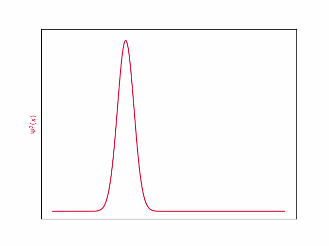

#  Zabawa z fal(k)ami, czyli numeryczne rozwiązywanie równania Shrodingera
  
  
##  Wstęp
  
Chyba każdy, kto choć trochę interesuje się fizyką słyszał o pewnym żywo-martwym kocie i o uwięzionych elektronach, które są, lecz nie wiadomo gdzie. Nic w tym dziwnego, cuda mechaniki kwantowej zaprzątają nasze umysły. Zawsze jednak mierził mnie fakt, że opis mikroświata ukryty jest za trudnymi konceptami matematycznymi, a zwykłemu człowiekowi pozostają jednie jakościowe charakteryzacje . Postanowiłem to zmienić, i w sposób dosyć nieudolny, z pomocą komputera, a nie formalizmu matematycznego "pobawić się" elektronami.
  
##  Równanie Shrödingera
  

  
  
  
Równanie Shrödingera jest podstawowym elementem mechaniki kwantowej. Opisuje funkcję falową oraz jej zmiany w czasie. Czym jest funkcja falowa ? Nie da się jej zinterpretować wprost, jednak zawiera wszystkie informacje o położeniu i pędzie analizowanej cząstki, które możemy wyłuskać przy użyciu odpowiednich operacji. Kwadrat modułu (w sensie liczb zespolonych) funkcji  opisuje gęstość prawdopodobieństwa, czyli szanse, że cząstka znajduje się w tej okolicy. 
  
Pozostałe literki?  to stała Plancka kreślona V(x,t) to potencjał, opisuję jaką energię potencjalną miałaby cząstka, gdyby znalazła się w tym punkcie i czasie. 
  
  
 zależy od położenia w przestrzeni i czasu, przyjmuje natomiast wartości zespolone. 
  
##  Jak to rozwiązać?
  
Najprostsze do rozwiązania są problemy stacjonarne, to znaczy takie, w których moduł funkcji nie zmienia się z upływem czasu, a funkcja drga niczym fala stojąca na sznurku. Wtedy równanie przyjmuje taką postać:

  
  
[wyprowadzenie](https://tutaj_wyprowadzenie_dodaj.com )
  
Równanie wygląda troszeczkę przyjmniej, jednak wciąż niezbyt wiadomo co można z nim zrobić. Z odsieczą przyjdzie nam kilka matematycznych sztuczek. Wyobraźmy sobie, że  jest wektorem o nieskończonej liczbie wymiarów (ściślej mówiąc, jest w przestrzeni Hilberta), a każdy wymiar wektora opisuje jeden punkt w przestrzeni funkcji. Rysunek poniżej jest jedynie poglądowy, gdzyż pomija fakt, że  jest zespolone, a wektor ma continuum wymiarów. 

  
Taka wektorowa interpretacja pozwoli nam na stosowanie metod algebry liniowej. Niestety komputery krzemowe nie pojmują nieskończoności, dlatego zamiast martwić się continuum wymiarowym wektorem, wygodnie podzielimy przestrzeń na  odcinków.  
  
Chcielibyśmy myśleć o  jak o macierzy, która działa jako operator (zwany operatorem Hamiltona) na wektorze . Problem jest jendak jak sprowadzić  do macierzy? Rozważmy jeden punkt w przestrzeni. Obserwując różnice Korzystając z szeregu Taylora, możemy wyliczyć następującą postać aproksymacji w punkcie x:
  

  
,gdzie .
  
Zauważmy, że są to przekształcenia liniowe, dlatego możemy wpisać współczynniki w odpowiednie miejsca macierzy
  

  
  
  
Taka macierz nazywana jest Hamiltonianem (operatorem Hamiltona) i jest oznaczna H. Tralala liczy energie falki.
  
Podsumowując, chcemy rozwiązać równanie , gdzie  to macierz, E skalar, a  wektor. Czy to czegoś nie przypomina? Ależ oczywiście, jest to problem znajdowania wektorów i wartości własnych macierzy, który można spotkać na wykładzie z algebry liniowej. Szczerze mówiąc, byłem ogromnie uradowany, że tak pozornie nudny koncept, który niedawno poznałem, okaże się użyteczny w takim miejscu. 
  
Na szczęście wyznaczanie wartości własnych jest całkiem popularnym problem, także nie musimy się nim martwić. Sprowadziliśmy problem do zagadnienia już rozwiązanego, a czyż nie o to w życiu chodzi?
  
##  Studnia potencjału
  
Najprostszy problem fizyki kwantowej, który można stosunkowo łatwo rozwiązać, nawet metodami analitycznymi to elektron umieszczony w tak zwanej studni potencjału. Studnia potencjału to potencjał, taki, że na pewnym przedziale przyłożony potencjał zewnętrzny jest równy zeru, poza nim natomiast wynosi on nieskończoność. Elektron jest spułapkowany "na dnie studni", gdyż jego energia kinetyczna i potencjalnie jest niewystarczajacą do przekroczenia nieskończenie wysokiej bariery. Poza teoretycznym rozważaniem, takiem układem mogą być dwie płyty oddalone o (naście wstaw tutaj jakąś liczbę nm).
  

  
  
  
  

  
##  Upływ czasu
  
A co gdybyśmy chcieli zobaczyć nasz elektron w ruchu? Możemy skorzystać z metody Cranka-Nicolson. Znając obecną wartość  możliwe jest wyliczenie przybliżonej wartości w momencie 

  
  
  
  
  
##  Wolna cząsteczka i zasada nieoznaczoności
  
Rozważmy elektron poruszający się z pewną prędkością w prawo, bez oddziaływań zewnętrznych. Zadamy go następującym pakietem:

  
 gdzie  to położenie początkowe,  liczba falowa,  niepewność położenia początkowego. W jednym przypadku weźmy ,

a w drugim .

  
W obu przypadkach wraz z upływem czasu niepewność położenia wzrasta. Jest to spowodowane tym, że zgodnie z zasadą nieoznaczoności pęd (więc również prędkość) nie może być dokładnie znana.

  
  
Im dokładniej znamy położenie  tym większą niepewność . Co za tym idzie wierzchołek na górnym wykresie ulega znacznie szybszemu spłaszczeniu, bo zawiera dokładniejszą informację o pozycji. Pod koniec symulacji oba wykresy niemalże zrównuje się, ponieważ zawierały taką samą, maksymalną ilość informacji. Warto podkreślić, że takie zachowanie nie jest spowodowane jakąkolwiek niedoskonałością fizycznych pomiarów, bądź symulacji, lecz jest elementem działania wszechświata, który został zakodowany w równaniu Shrödingera.
  
##  Atom wodoru w 3D
  
  
##  Eigenstany
  
- Rozkład na stany
- eigenvalues to Energie
  
##  Kody
  
Kod źródłowy do wykonania obliczeń jest dostępny na [moim GitHubie](https://github.com/krzysztof9nowak/quantum_tricks ).
  
##  Bibliografia
  
Włodzimierz Salejda 
  
https://www.caam.rice.edu/software/ARPACK/UG/node45.html
  
https://dantoudai.wordpress.com/2020/06/07/schrodingers-python-2/
  
Quatnum Mechanics, B.H. Bransden & C.J. Joachain
  
http://www.physics.utah.edu/~detar/phycs6730/handouts/crank_nicholson/crank_nicholson/
  
https://jakevdp.github.io/blog/2012/09/05/quantum-python/
  